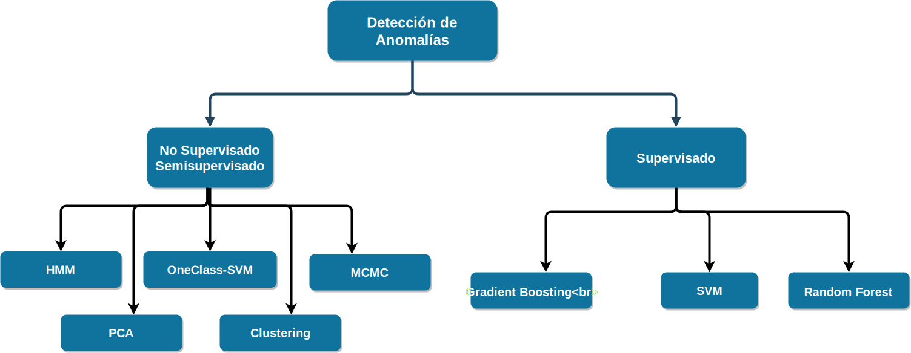
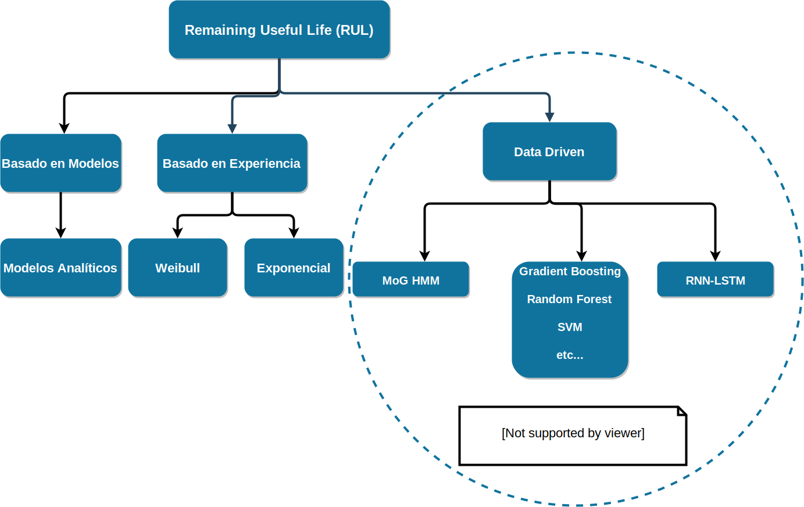
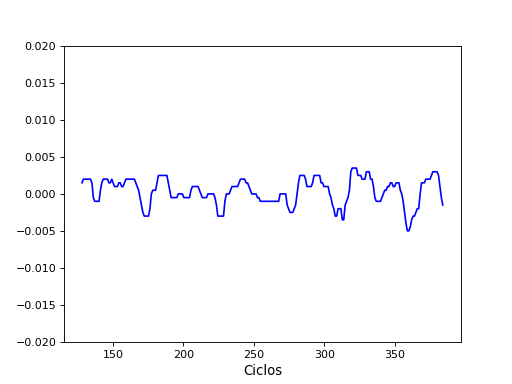
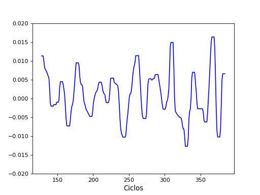
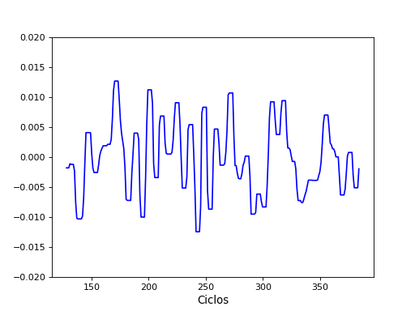
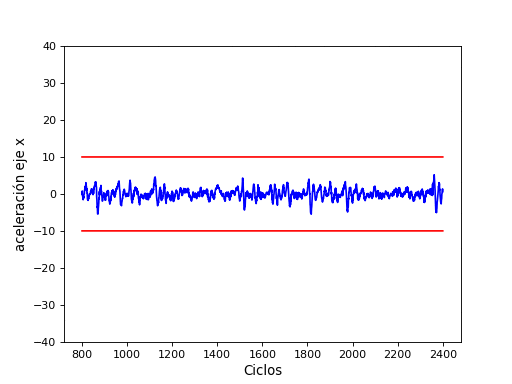
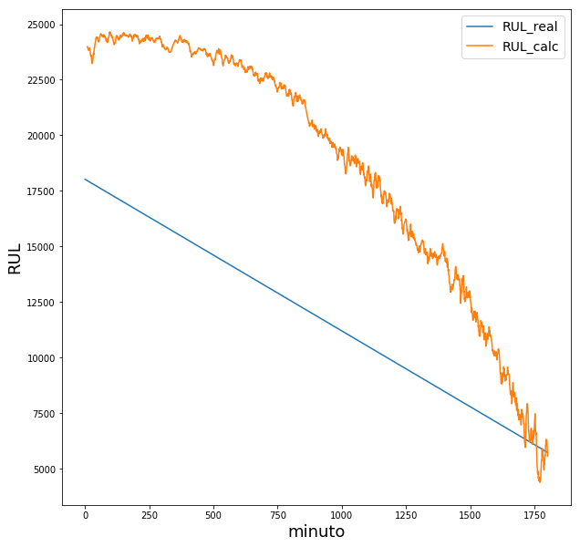
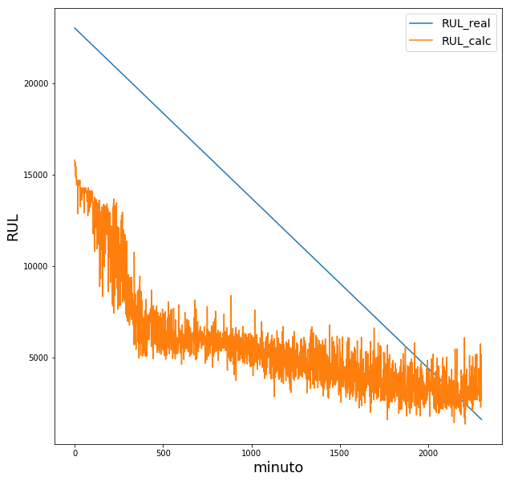
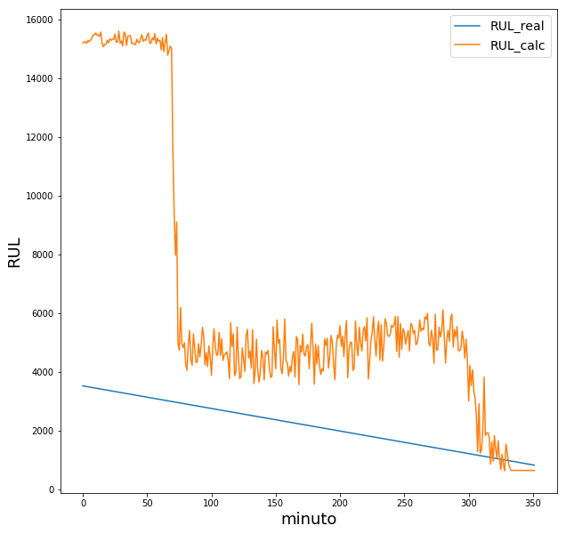
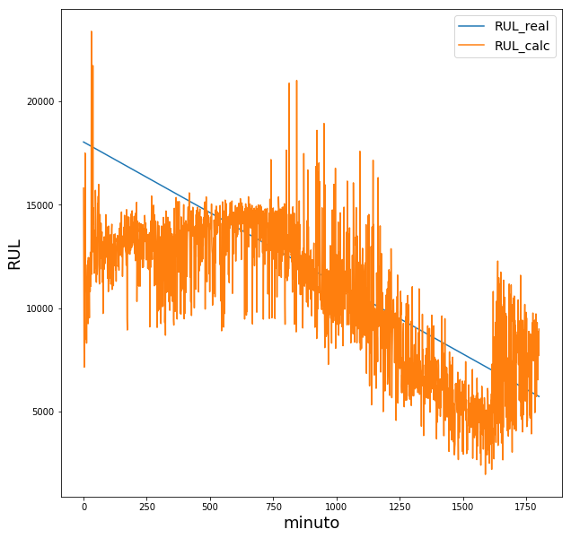

```{r, load_refs, echo=FALSE, cache=FALSE}
library(RefManageR)
BibOptions(check.entries = FALSE, 
           bib.style = "authoryear", 
           cite.style = 'authoryear', 
           style = "markdown",
           hyperlink = FALSE, 
           dashed = FALSE)
myBib <- ReadBib("assets/example.bib", check = FALSE)

## Agregar todas las referencias que no se citan aqui
## Se suprime la impresion asingando a una variable
a <- Cite(myBib,"tobon2012data",textual = FALSE)
a <- Cite(myBib,"tobon2011hidden",textual = FALSE)
a <- Cite(myBib,"wu2016rul",textual = FALSE)
#AutoCite(myBib,"deutsch2018development")
a <- Cite(myBib,"zhang2018multi",textual = FALSE)
a <- Cite(myBib,"lee2009rexnord",textual = FALSE)
a <- Cite(myBib,"james2013introduction",textual = FALSE)
a <- Cite(myBib,"friedman2001elements",textual = FALSE)
a <- Cite(myBib,"saxena2008metrics",textual = FALSE)
a <- Cite(myBib,"verma2015data",textual = FALSE)
a <- Cite(myBib,"nectoux2012pronostia",textual = FALSE)

```


class: secciones
background-image: url("assets/logocimat.png")
background-size: 10%
background-position: 5% 95%

## Organización


- Antecedentes
- Definición del problema
- Justificación
- Objetivos
- Metodología 
- Experimentos y Resultados
- Contribuciones
- Conclusión y trabajo futuro

---
background-image: url("svg/Mantenimiento_Diagrama.svg")
background-position: 30% 40%
background-size: 90% 90%
## Antecedentes
### <center> Tipos de Mantenimiento </center>

---
background-image: url("svg/Dibujo_Degradacion_sistema.svg")
background-position: 40% 65%
background-size: 60% 80%
## Esquema de degradación de un sistema

---
background-image: url("svg/Barras_Fases_Mantenimientos.svg")
background-position: 40% 65%
background-size: 90% 90%
## Evolución Mantenimientos

---
## Definición del problema

- Detección de estados anómalos y el estado actual de la máquina.

- Calcular los tiempos de vida restante útil de Máquinas/herramientas
en base a la información de múltiples sensores en tiempo real

- Conjuntar los 2 procesos previos, para predecir el RUL en el caso de que se haya entrado a la fase de transición


<!-- We aim to monitor the status  of the machine health in real time using multiple sensors and develop a machine learning based algorithm to automate predictive maintenance methodology. We divide the problem into two parts: -->
<!-- To monitor the state of the machine (normal, transition, fail) based on the information of the sensors in real time  -->
<!-- Compute the Remaining Useful Life (RUL) of the machine. -->

---
## Justificación

Existen estudios previos que muestran que es posible realizar la
detección de anomalías y predicción de vida útil usando datos de
sensores ( de un tipo de sensor), pero es posible extender las
metodologías y aumentar el desempeño en estas tareas usando la
combinación de sensores y desarrollar algoritmos nuevo de ML e IA.


---
## Objetivos
- Implementar los métodos de ML e IA para detectar estados
anómalos (estado correcto, transición, fallo) en tiempo real,


- Lograr predecir con buena precisión el RUL (Tiempo de Vida
Restante Útil) de componentes/máquinas a partir de los datos
sensoriales disponibles


- Cálculo de características de datos de sensores
(WPD,Estadistícas,FFT) y implementar metodología de
selección de características importantes.

---
## Objetivos


- Implementar en diferentes aplicaciones (Componentes críticos
de sistemas hidráulicos, drilling)


- Se pretende exponer las ventajas de métodos más recientes vs
métodos clásicos, y de los métodos propuestos contra los métodos de la literatura.

---
## Metodología
<center></center>
<hr>
<center></center>

---
background-image: url("svg/Metodologia_online.svg")
background-position: 20% 50%
background-size: 90% 90%
## Metodología Online

---
## Metodología
### Métricas

Para comparar los modelos y sus desempeños se usará algunas métricas relevantes como las siguientes:

.pull-left[
**Regresión**
- MAE - $\frac{1}{n}\sum_{j=1}^{n}|\Delta(i)|$
- SMAPE - $\frac{1}{n}\sum_{j=1}^{n}|\frac{100\Delta(i)^2}{ (y_i+\hat{y_i})/2 }|$
- RMSE - $\sqrt{\frac{1}{n}\sum_{j=1}^{n}|\frac{100\Delta(i)^2}{y_i }|}$
- Métricas específicas para penalizar pronósticos que sobrepasen RUL real
]
.pull-right[
**Clasificación**
- accuracy - $\frac{(TP+TN)}{TP+FP+FN+TN}$
- precisión - $\frac{TP}{TP+FP}$ 
- recall - $\frac{TP}{TP+FN}$
- F1 - $2*\frac{Precision*Recall}{Precision+Recall}$
- ... Otras métricas para clases desbalanceadas
]

---
## Datos para experimentos

.pull-left[
#### Componentes Hidráulicos
- NASA Bearings IMS
  - ti.arc.nasa.gov/tech/dash/-groups/pcoe/prognostic-data-repository/
- FEMTO PHM 2012 Challenge
  - data-acoustics.com/measurements/-bearing-faults/bearing-6/
- Experimentos Bearing CIDESI
]

.pull-right[
#### Drilling

- Drilling (IIT)
  - www.iitk.ac.in/iil/datasets/
- Experimentos Drilling CIDESI
]

---
background-image: url("svg/NASA_Bearings_dibujo.svg")
background-position: 0% 20%
background-size: 50% 50%
## NASA Bearings

.pull-right[
* Rotación 2000RPM
* 6.5 GB's de datos
* 3 Sets de corrida hasta fallo
* 2156/984/6324 archivos/set
* Frec. muestreo 20kHz
]

<iframe src="htmls/NASA_rms.html" width="100%" height="280" style="border: none;">

---
## DRILLING

</img>
.pull-left[





]

.pull-right[
- 3-AxisCNC EMCO Concept Mill 105
- Broca de 9 mm de diámetro
- Frec. muestreo = 32768 Hz
- 4 Estados (3 Fallos, 1 Perfecto)
- 121 Muestras Totales
- Cada muestra consta de 8 seg
]

http://www.iitk.ac.in/iil/datasets/

---
background-image: url("svg/Degreadacion_tiempo_fft_tiempo.draw.svg")
background-position: -15% 60%
background-size: 60% 80%

## FEMTO PHM2012

.pull-right[

</br> 
Frec. muestreo: 25.6 KHZ </br>
3 Tipos de Condición </br>
6/11 Corridas Train-Test</br>
2GB Información.</br>
]
<br>
<br>
http://data-acoustics.com/measurements/bearing-faults/bearing-6/

---
## Estadísticos para el dominio del Tiempo

Dependiendo la frecuencia de muestreo de la señal y de las frecuencias internas de la señal, es posible sumarizar la información y reducir a una matriz de características por cada cierto segmento de un tamaño apropiado con lo cual puede ser más manejable tratar la información para dejarla lista para realizar clasificación o agregación

.pull-left[
- Media absoluta 
- Raiz cuadratica media
- Asimetría (Skewness)
- Rango intercuartil
- Picos encima de cuartiles superiores

]

.pull-right[
- Desviación estándar
- Distancia pico a pico (peak to peak)
- Varianza
- Kurtosis (cuarto momento)
- Entropía
]


---
background-image: url("svg/WPD(1).svg")
background-position: 40% 40%
background-size: 70% 70%
## <sup>Wavelet Packet Transform y Wavelet Decomposition</sup>

---
background-image: url("svg/FFT.svg")
background-position: 40% 40%
background-size: 70% 70%
## Fast Fourier Transform

---
background-image: url("svg/Matriz_features.svg")
background-position: 40% 40%
background-size: 70% 70%
## Matriz de Características


---
## Experimento clasificación de errores (Drilling)

- Se realizó un ejercicio de clasificación sobre datos de Drilling, para usar algunos de los pasos como es el preprocesamiento, la transformación de características y la clasificación en sí. Aún está pendiente realizar Optimización de hiperparametros y validar con varias métricas el desempeño.

- Se mandó ejecutar varios clasificadores base para ver cuanta diferencia se muestra entre los clasificadores base contra los de boosting y bagging, y ver si los que consideran relaciones lineales logran algo por encima del azar.


<!-- --- -->

<!-- ## Resultados Clasificación Drill Data Set -->

<!-- **Resultados** -->

<!-- | Index | classifier                   | train_score | test_score | train_time | -->
<!-- |-------|------------------------------|-------------|------------|------------| -->
<!-- | 0     | Gradient Boosting Classifier | 1           | 0.982877   | 2.140795   | -->
<!-- | 1     | Random Forest                | 1           | 0.958904   | 0.039526   | -->
<!-- | 3     | Nearest Neighbors            | 0.946108    | 0.928082   | 0.00812    | -->
<!-- | 4     | Decision Tree                | 1           | 0.900685   | 0.142393   | -->
<!-- | 2     | Logistic Regression          | 0.85479     | 0.84589    | 0.325299   | -->
<!-- | 8     | AdaBoost                     | 0.838323    | 0.780822   | 0.95439    | -->
<!-- | 7     | Naive Bayes                  | 0.754491    | 0.756849   | 0.006918   | -->
<!-- | 6     | Neural Net                   | 0.55988     | 0.537671   | 0.359009   | -->
<!-- | 5     | Linear SVM                   | 1           | 0.246575   | 0.375702   | -->
<!-- | 9     | Gaussian Process             | 1           | 0.239726   | 1.829299   | -->

---
## Clasificación Drilling Accuracy/Performance

<span><iframe src="bar_accuracy.html" width="49%" height="500" style="border: none;"></iframe></span>
<span><iframe src="bar_tiempo.html" width="49%" height="500" style="border: none;"></iframe></span>

---
background-image: url("svg/Res_Confusion_DRILL.svg")
background-position: 70% 60%
background-size: 80% 80%
## Resultados

---
## FEMTO PHM 2012 (Metodologías)

Se ha aplicado 2 metodologías :
- Usar los datos de entrenamiento sin considerar estratificar modelos en base a tipos de Bearings

- Generación de modelo por cada tipo de Bearing, y selección de modelo usando (DTW, HMM) 

Al momento ambos métodos presentan resultados no mejores al ganador de la competencia

---
background-image: url("svg/Copia_de_EsquemaProceso.svg")
background-position: 40% 40%
background-size: 90% 90%
## FEMTO PHM 2012 (Metodologías)


---
## FEMTO PHM 2012 (Resultados)





---
## FEMTO PHM 2012 (Resultados)
Para la competencia PHM 2012 **`r Citet(myBib,"nectoux2012pronostia")`** se solicita usar una métrica que penaliza más los pronósticos tardíos


$$\%Er_i = 100*\frac{ActRUL_{i}-\hat{RUL}}{ActRUL_i}$$

y la penalización se realiza con la siguiente función


$$
   A_{i} = 
   \begin{cases}
       e^{-ln(0.5)(Er_i/0.5)} & \text{si $Er_i \leq 0$}\\
       e^{+ln(0.5)(Er_i/20)} & \text{si $Er_i \geq 0$}\\
  \end{cases}
$$

- Sin seleccionar modelo en base a datos de señal: $A_i ~ 0.10-0.15$
- Seleccionando modelo en base a DTW o HMM : $A_i ~ 0.20-0.25$
- Ganador de la competencia Sutrisino **`r Citet(myBib,"sutrisno2012estimation")`**: $0.3066$


---
## NASA Bearings IMS (Análisis Exploratorio)

<iframe src="htmls/entropia_time.html" width="49%" height="360"></iframe> 
<iframe src="htmls/chunk1_fft.html" width="49%" height="360"> </iframe>

<iframe src="htmls/energia_wavelet_nodo0.html" width="99%" height="300"></iframe>

---
## NASA Bearings (Metodologías )
Se está desarrollando y buscando la metodología adecuada, 

- Obtener características, Selección de Variables importantes, Usar cada señal por separado, Seleccionar mejor modelo según ajuste de señal de prueba.
- Usar método MoG-HMM como se propone en **`r Citet(myBib,"tobon2012data")`**
- (Pendiente) Aumentar características agregando como predictor la clasificación del estado de la maquina (bueno,transición)


---
## NASA Bearings (Resultados)
Aún se está en desarrollo por lo cual aún no se tiene resultados concluyentes para este experimentos, a excepción de pruebas de validación.

---
## Contribuciones

- Existen estudios previos que muestran que es posible realizar la detección de anomalías con el sensor, por ejemplo: es posible detectar las fallas de bombas y cálculo de RUL con los datos de acelerómetros, en este estudio proponemos combinación de sensores (acelerómetro, voltaje y corriente) para mejorar la precisión del resultado del modelo de pronóstico.

- Algoritmo corriendo durante la generación de los datos.


---
## Conclusión y Trabajo Futuro

- Se comparó métodos base o clásicos contra métodos de boosting para comprobar la diferencia en desempeño.

- Se vio que es posible aumentar la exactitud de las predicciones de clasificación, usando características Wavelets.

- Para la parte de Predicción de tiempo o ciclos de vida restante útil, se ha probado varias metodologías y aun se esta realizando desarrollo y pruebas de otra metodología.

- En cuanto al documento formal de la tesina se tiene un avance considerable, falta agregar parte de los resultados que se tienen más los que faltan, y agregar un capítulo de teoría.

---
## Bibliografía

```{r, results = "asis", echo=FALSE}
PrintBibliography(myBib,start = 1,end = 5)
```

---
## Bibliografía

```{r, results = "asis", echo=FALSE}
PrintBibliography(bib=myBib,start = 6,end =10)
```

<!-- Ejemplos codigo -->
<!-- .pull-left[ -->
<!--  -->
<!-- ] -->

<!-- .pull-right[ -->
<!--  -->
<!-- ] -->

<!-- Util para sacar colores https://community.linuxmint.com/software/view/gpick -->


<!-- knitr::kable(matrix(rnorm(120),ncol = 12,nrow =10 ),format="latex") -->
 <!-- Render equations in SVG -->
 
<!--  --- -->
<!-- class: title-slide -->
<!-- background-image: url("assets/logocimat.png") -->
<!-- background-position: 10% 90%, 100% 50% -->
<!-- background-size: 160px, 100% 100% -->

<!-- # .black[Manual title slide] -->

<!-- ## Subtitle -->

<!-- ### Author -->

<!-- ### Date -->

<!-- Generar tablas markdown https://www.tablesgenerator.com/markdown_tables -->

<!-- - `r AutoCite(myBib,"tobon2012data")` -->

<!-- --- -->
<!-- ## Video  -->

<!-- <video src="/home/adrianrdzv/Escritorio/CIMAT/TESINA/protocolo_entrega/videos/Experimentacion_drill.mp4">[alt]</video> -->